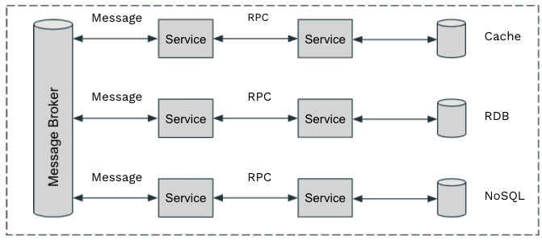
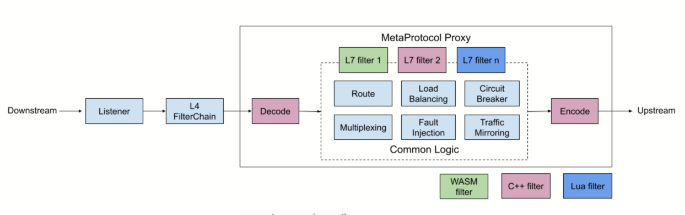
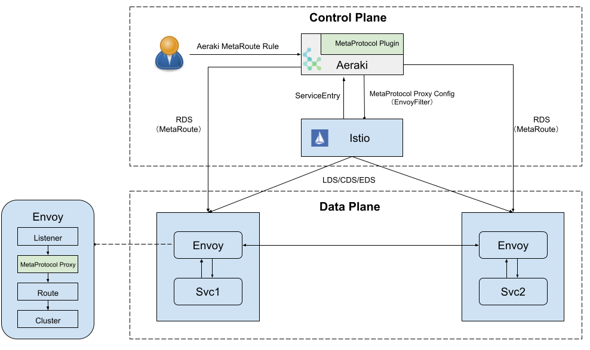

[中文](README_ZH.md)

# meta-protocol-proxy

## Why MetaProtocol is needed?

Almost all open source and commercial Service Meshes currently support only two Layer-7 protocols - HTTP and gRPC. 
Other widely used protocols in microservices, including Dubbo, Thrift, Redis, MySql, etc. can only be handled as plain TCP traffic 
, hence advanced traffic management capabilities promised by Service Mesh are not available for those protocols. In addition, 
some microservices are using proprietary RPC protocols for inter-service communication, we need to manage these protocols as well.

As shown in the figure below, we usually have these layer-7 protocols in a typical microservice application

* RPC： HTTP、gRPC、Dubbo、Thrift、proprietary RPC ...
* Async Message：Kafka, RabbitMQ ...
* DB：mySQL, PostgreSQL, MongoDB ...


## What MetaProtocol provides?

MetaProtocol is aimed to support any layer-7 protocols in Service Mesh. 
* Data plane：MetaProtocol Proxy provides common capabilities for Layer-7 protocols, such as load balancing, circuit breaker, load balancing, routing, rate limiting, fault injection, and auth.
  
* Control plane：[Aeraki](https://github.com/aeraki-framework/aeraki) provides a centralized control plane for MetaProtocol Proxy. 
  Aeraki sends the configuration and dynamic routing rules to the MetaProtocol Proxies in the data plane. It also has high-level CRDs to 
  provide a user-friendly interface to operation teams. Advanced traffic management such as traffic splitting, canary deployment, traffic mirroring, and RBAC can be achieved by these CRDs.
  

To add a new protocol into the service mesh, the only thing you need to do is implementing the [codec interface](src/meta_protocol_proxy/codec/codec.h#L118).

If you have special requirements which can't be meet by the built-in capabilities, MetaProtocol Proxy also has a filter chain mechanism, 
allowing users to write their own layer-7 filters to add custom logic into MetaProtocol Proxy.

## Build MetaProtocol Proxy

Follow this guide [Building Envoy with Bazel](https://github.com/envoyproxy/envoy/blob/main/bazel/README.md) to install the required software.

Below is how to build on Ubuntu 18.04

### Install Bazelisk as Bazel

It is recommended to use Bazelisk installed as bazel, to avoid Bazel compatibility issues.

```bash
sudo wget -O /usr/local/bin/bazel https://github.com/bazelbuild/bazelisk/releases/latest/download/bazelisk-linux-$([ $(uname -m) = "aarch64" ] && echo "arm64" || echo "amd64")
sudo chmod +x /usr/local/bin/bazel
```

### Install external dependencies

```bash
sudo apt-get install \
autoconf \
automake \
cmake \
curl \
libtool \
make \
ninja-build \
patch \
python3-pip \
unzip \
virtualenv
```

### Install build toolchain

```bash
sudo add-apt-repository ppa:ubuntu-toolchain-r/test
sudo apt update
sudo apt-get install llvm-10 lldb-10 llvm-10-dev libllvm10 llvm-10-runtime clang-10 clang++-10 lld-10 gcc-10 g++-10
```

### Build
Run  ```make build```, if the build completes successfully, the generated binary will be at ```bazel-bin/envoy```, which contains 
the MetaProtocol Proxy and the codecs of the application protocols.

To build MetaProtocol proxy for production, run ```make build_release```.

## Test MetaProtocol Proxy

Two layer-7 protocols, [Dubbo](src/application_protocols/dubbo) and [Thrift](src/application_protocols/thrift
), have been implemented based on MetaProtocol. More protocols are under development.

### Dubbo
Since the dubbo test client will use dns name ```org.apache.dubbo.samples.basic.api.demoservice``` to access th dubbo test server, we need to
add the below line to hte hosts file:

```bash
127.0.0.1 org.apache.dubbo.samples.basic.api.demoservice
```

Run ```./test/dubbo/test.sh ```, this script will run the envoy, dubbo test client and dubbo test server。You'll expect to see the below output:

```bash
Hello Aeraki, response from ed9006021490/172.17.0.2
Hello Aeraki, response from ed9006021490/172.17.0.2
Hello Aeraki, response from ed9006021490/172.17.0.2
```

This output means that the dubbo test client has successful reached the dubbo test server through envoy MetaProtocol proxy. 
To understand how it works, you can look into [test/dubbo/test.yaml](test/dubbo/test.yaml) and play with the MetaProtocol configuration.

### Thrift

Run ```./test/thrift/test.sh ```, this script will run the envoy, thrift test client and thrift test server。You'll expect to see the below output:

```bash
Hello Aeraki, response from ae6582f53868/172.17.0.2
Hello Aeraki, response from ae6582f53868/172.17.0.2
Hello Aeraki, response from ae6582f53868/172.17.0.2
```

This output means that the thrift test client has successfully reached the thrift test server through envoy MetaProtocol proxy. 
To understand how it works, you can look into [test/thrift/test.yaml](test/thrift/test.yaml) and play with the MetaProtocol configuration. 

### RDS

MetaProtocol framework implements RDS discovery protocol, which means the route configuration can be fetched from a RDS server on the fly. MetaProtocol Proxy will apply the updated routes to all the subsequent requests, and
the existing connections won't be interrupted in this process.

Run ```./test/rds/test.sh ```, this script will run the envoy, an example rds server, dubbo test client and thrift test server。You'll expect to see the below output:

```bash
Hello Aeraki, response from 400c8a27e761/172.17.0.2
Hello Aeraki, response from 400c8a27e761/172.17.0.2
Hello Aeraki, response from 400c8a27e761/172.17.0.2
```

This output means that the dubbo test client has successfully reached the dubbo test server through envoy MetaProtocol proxy, with the route configuration fetched from the RDS server.
To understand how it works, you can look into [test/rds/test.yaml](test/rds/test.yaml) and play with the MetaProtocol configuration. 
